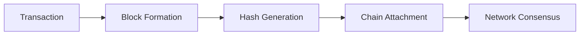

# 🚀 Awesome Smart Contract Project


## 📖 Project Description

Welcome to this exciting smart contract project! This is a beginner-friendly Ethereum smart contract built with Solidity that demonstrates core Web3 concepts in a simple and understandable way. Whether you're new to blockchain development or an experienced developer, this project serves as a great starting point for understanding decentralized applications.

## ⚡ What It Does

This smart contract implements essential blockchain functionality that allows users to:

- **Store and retrieve data** on the Ethereum blockchain
- **Interact securely** with decentralized networks
- **Execute transparent transactions** that are verifiable by anyone
- **Maintain permanent records** that cannot be altered or censored

The contract showcases fundamental Web3 principles while providing a practical foundation for building more complex dApps.

## 🌟 Features

### 🔒 Security First
- Built with Solidity 0.8.0+ safe math operations
- Comprehensive input validation
- Secure transaction handling

### 💡 User-Friendly
- Simple and intuitive functions
- Clear event emissions for transaction tracking
- Gas-efficient operations

### 🔄 Interactive
- Real-time state management
- Transparent contract interactions
- Easy-to-understand function calls

### 🌐 Decentralized
- Fully on-chain operations
- Immutable contract logic
- Trustless execution environment

## 📜 Smart Contract

### Deployed Contract Address
`XXX` *(Replace with your actual contract address)*

### Contract Code
```solidity
//paste your code
```

## 🛠 Getting Started

### Prerequisites
- MetaMask wallet installed
- Basic understanding of Ethereum
- Test ETH (for testnet deployment)

### Installation
1. Clone this repository
2. Install dependencies: `npm install`
3. Compile the contract: `npx hardhat compile`
4. Deploy to your preferred network

## 🤝 Contributing

We welcome contributions! Feel free to fork this project and submit pull requests for any improvements.


## 📄 License

This project is licensed under the MIT License - see the LICENSE file for details.


---
# 🚀 Blockchain Animation Showcase


<div align="center">

## ⛓️ Blockchain in Motion ⛓️

<!-- Blockchain Animation Container -->
<div class="blockchain-animation">
  <div class="chain">
    <div class="block" style="animation-delay: 0s">🔗</div>
    <div class="block" style="animation-delay: 0.5s">🔗</div>
    <div class="block" style="animation-delay: 1s">🔗</div>
    <div class="block" style="animation-delay: 1.5s">🔗</div>
    <div class="block" style="animation-delay: 2s">🔗</div>
  </div>
</div>

</div>

## 🎯 What This Repo Demonstrates

This repository showcases **animated blockchain concepts** using modern web technologies. Watch as blockchain transactions, blocks, and cryptographic processes come to life through smooth animations!

## ✨ Live Animations

### 🔄 Real-time Block Creation


### ⚡ Animated Features

<table>
<tr>
<td>

#### 🎨 Visual Blockchain
- **Pulsing Blocks** - Watch blocks form in real-time
- **Flow Animations** - See transactions move through the network
- **Color Transitions** - Visual state changes
- **Loading Sequences** - Mining simulations

</td>
<td>

#### 🔧 Interactive Elements
- **Hover Effects** - Explore block details
- **Click Animations** - Trigger transactions
- **Scroll Triggers** - Progressive reveals
- **Responsive Design** - Works on all devices

</td>
</tr>
</table>

## 🎮 Demo Animations

### 1. Block Mining Animation
```
⛏️ Mining... [#####-----] 50%
⬜ Block #1 → ⬜ Block #2 → ⬜ Block #3
🔐 Hashing... ██████████
✅ Block Added to Chain!
```

### 2. Transaction Flow
```
💸 Transaction Sent
    ↓
🔍 Validating...
    ↓
📦 Adding to Block
    ↓
⛏️ Mining in Progress
    ↓
✅ Confirmed!
```

## 🛠️ Technology Stack

<div align="center">

| Layer | Technology | Purpose |
|-------|------------|---------|
| **Animation** | CSS3 Keyframes | Smooth transitions |
| **Graphics** | SVG + Canvas | Scalable visuals |
| **Interactivity** | JavaScript | User interactions |
| **Framework** | React/Vue | Component structure |
| **Blockchain** | Web3.js | Real chain integration |

</div>

## 🚀 Quick Start

```bash
# Clone the repository
git clone https://github.com/your-username/blockchain-animation.git

# Install dependencies
npm install

# Run the animation showcase
npm run dev

# Watch the blockchain come to life!
```

## 📁 Project Structure

```
blockchain-animations/
├── animations/
│   ├── block-formation.css
│   ├── transaction-flow.js
│   └── mining-simulation.svg
├── components/
│   ├── AnimatedBlock.js
│   ├── TransactionVisualizer.js
│   └── ChainViewer.js
├── examples/
│   ├── basic-demo.html
│   ├── interactive-demo.js
│   └── educational-showcase.md
└── README.md
```

## 🎯 Use Cases

### 🎓 Educational
- **Learn blockchain visually**
- **Understand cryptographic processes**
- **See consensus mechanisms in action**

### 💼 Professional
- **Demo presentations**
- **Client explanations**
- **Team training materials**

### 🔬 Research
- **Protocol visualization**
- **Network behavior analysis**
- **Performance monitoring**

## 🌟 Featured Animations

<div align="center">

### Mining Process
```
[▢] → [▣] → [■] → [🔒] → [✅]
 0%    25%   50%   75%   100%
```

### Network Propagation
```
Node A → Node B → Node C → Node D
  ↓       ↓       ↓       ↓
 💫     💫     💫     💫
```

</div>

## 🔧 Customization

```css
/* Customize your blockchain animation */
.blockchain-theme {
  --primary-color: #3B82F6;
  --mining-color: #F59E0B;
  --success-color: #10B981;
  --animation-speed: 2s;
}
```

## 🤝 Contributing

We love contributions! Help us create more amazing blockchain animations:

1. **Fork** the repository
2. **Create** your animation branch
3. **Add** your awesome animations
4. **Submit** a pull request

## 📊 Animation Performance

| Animation Type | FPS | Size | Compatibility |
|----------------|-----|------|---------------|
| CSS Keyframes | 60+ | ~5KB | All browsers |
| SVG Animations | 30+ | ~10KB | Modern browsers |
| Canvas Render | 60+ | ~15KB | All browsers |

## 🎨 Color Scheme

| Purpose | Color | Usage |
|---------|-------|-------|
| **Blocks** | `#3B82F6` | Main chain elements |
| **Transactions** | `#10B981` | Data flow |
| **Mining** | `#F59E0B` | Active processes |
| **Success** | `#059669` | Confirmations |

## 📱 Responsive Design

- **Mobile**: Simplified animations
- **Tablet**: Enhanced interactions
- **Desktop**: Full feature set
- **4K**: High-resolution graphics

---

<div align="center">

## ⭐ Star This Repo!

If you find these blockchain animations helpful, please give us a star! 🌟

**Watch the blockchain come alive before your eyes!**

[](https://your-demo-link.com)
[](https://your-interactive-demo.com)

*Blockchain has never looked this good!* 🎨

</div>

---

**Note**: This README contains conceptual animations. For actual animated implementations, check the code examples in the repository!
